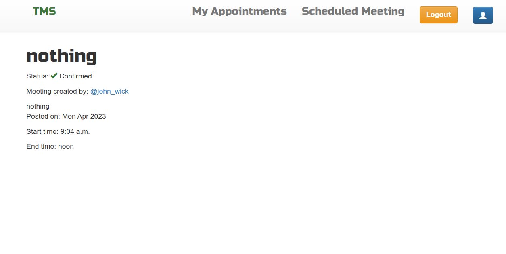
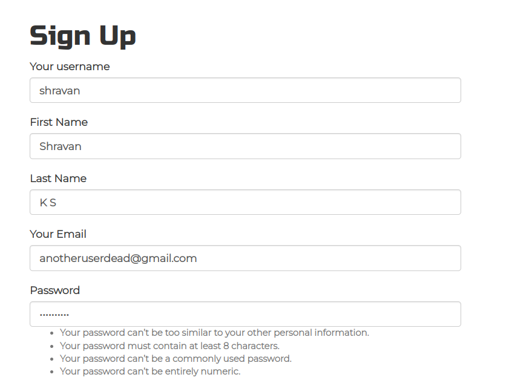
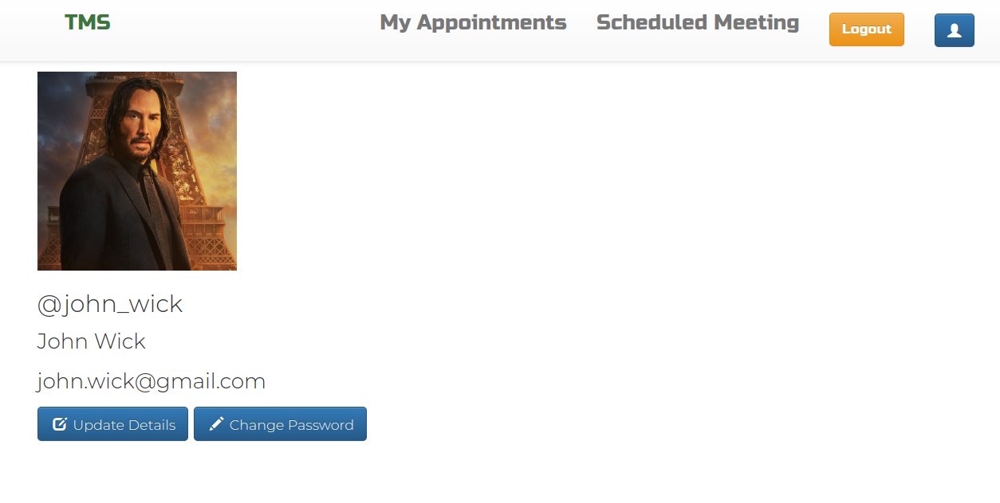

# Meeting Scheduler - Nbyula Assignment 1
A platform to schedule a meeting by considering the off hours of the other terraformers

[website link](http://shravanksubrahmanya.pythonanywhere.com/)

The project has a secure platform for the Terraformers to Create/schedule meeting with other terraformers by considering their off hours. A Terraformer can Login, Update his profile and password, Mark his off-hours of the day and can schedule meeting with other terraformer. If the meeting schedule overlaps with the off-hour of the guest, the terraformer can not schedule the meeting. The terraformer can refer the Off-hour schedule of other terraformers before creating the meeting.
Once the meeting has been scheduled the guest has to confirm it to make that as an appointment. The guest can cancel the appointment as well. This module is necessry in case there is another meeting has been scheduled with the guest for same timeslot.

### Frameworks used:
* Django
* python 3.11

### Frontend
* HTML
* CSS
* Javascript
* Jquery

### installing the project
* clone the git repository
* create a virtual environment using conda
* install django4.1
* install the following packages
  * pip install pillow
  * pip install django
  * pip install django-bootstrap4
  * pip install django_select2
  * pip install git+https://github.com/monim67/django-bootstrap-datepicker-plus.git
* cd into the first 'Nbyula_assignment_1' folder
* run the project using command - 'python manage.py runserver'

## Further help

Connect me using my linkedin link [Linkedin](https://www.linkedin.com/in/shravan-k-s-4a04ba155/) page.

## Screenshots:
* all of the screenshots of the project are provided in the 'screenshots' folder

### Request
I have developed the project well. I have invested my heart and soul for this opportunity. I want to inform you that I tried almost half a day trying to host this web application online. I tried multiple platforms as AWS, Heroku, Pythonanywhere. But there was some system error always. Since I had a Time constraint, I couldn't be able to host my web application properly. I deeply regret for my fallback. I have provided screenshots of the project as well along with website link. I request you to provide me one more opportunity to participate in the further rounds of the interview processes, by then I will make sure that I will host the web application online.  
